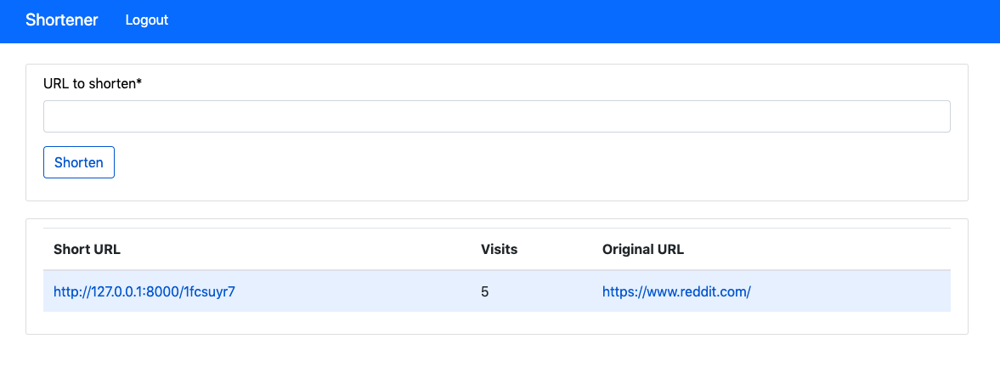
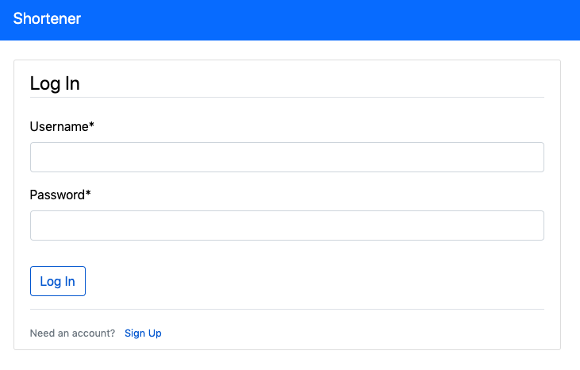
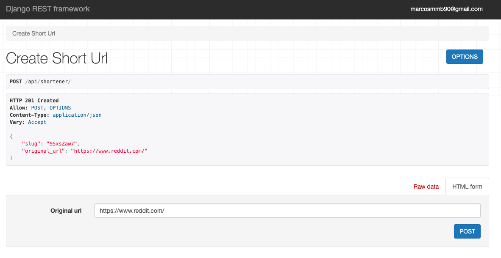

# URL Shortener



## Setting up

#### Python

The Python version used for this challenge was Python **3.7.7** - available at [python.org](https://www.python.org/downloads/release/python-377/).

#### Creating and setting up a virtual environment

The first and most important thing to do in order to run this code, is to create and set up a new virtual environment. If you don't have **virtualenv** installed, the following command installs it using **pip**:

```bash
pip install virtualenv
```

Creating a new virtual environment:

```bash
virtualenv env
```

Activating the environment:

```bash
source env/bin/activate
```

Installing all dependency packages:

```bash
pip install -r requirements.txt
```

#### Setting up project

Enter the project main directory

```bash
cd shorturl
```

In order to set up and create a database, run the migrations

```bash
python manage.py makemigrations
```

```bash
python manage.py migrate
```

It's also important to create a superuser for accessing the admin dashboard

```bash
python manage.py createsuperuser
```

And finally, locally run the server

```bash
python manage.py runserver
```

## Endpoints

### Home dashboard



[http://127.0.0.1:8000/](http://127.0.0.1:8000/)

By acessing the homepage, if you are not logged in, you will be redirectioned to a login page. If you don't have an account yet, you should create a new one on the Sign Up link, but the superuser account should work for now.

You then will be redirected to the main page where you can use the form to register a new short URL and see the list of all your shortened URLs.

It's possible to log out using the Logout button in the navbar.


### RESTful API



There are several endpoints to be used through RESTful API:

- Register a new account with [POST api/registration/](http://127.0.0.1:8000/api/registration/)

- Log in an account using a `username` and a `password` with [POST api/auth/login/](http://127.0.0.1:8000/api/auth/login/)

- Log out of an account with [POST api/auth/logout/](http://127.0.0.1:8000/api/auth/logout/)

- Shorten an URL with [POST api/shortener/](http://127.0.0.1:8000/api/shortener/) (authentication required!)